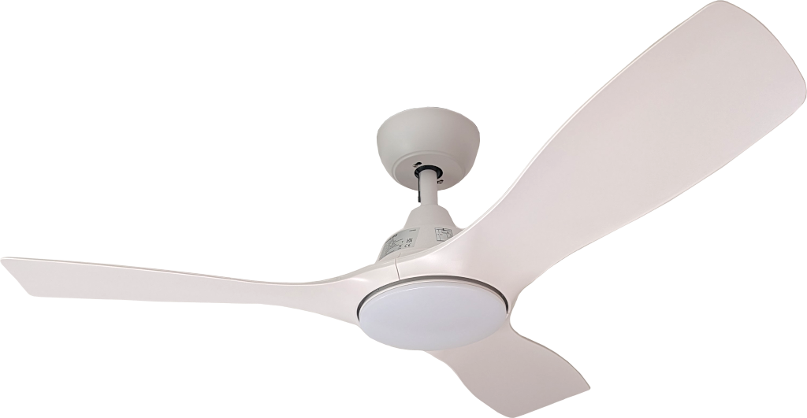
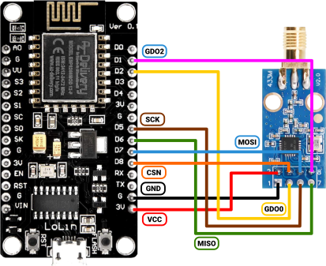
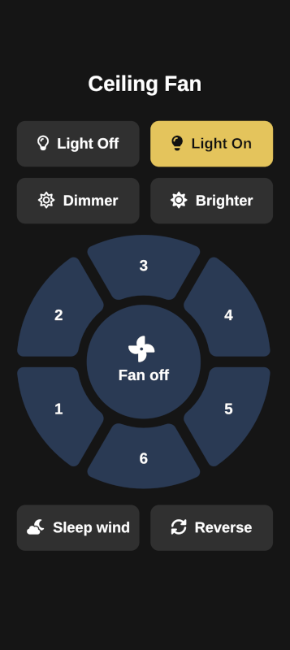

# PHILIPS Olas ceiling fan



This little project aims at implementing the protocol of the [PHILIPS Olas ceiling fan](https://www.lighting.philips.at/consumer/p/deckenventilator-mit-beleuchtung-olas-deckenventilatorleuchte-32-w-ventilator-24-w-leuchte/8720169369993) for the purpose of home automation. The software was implemented for an ESP8266 micro-controller (NodeMCU) connected to a CC1101 module, but it can easily be adopted to other platforms.

## Hardware

The remote can be prototyped on a simple breadboard. The circuit diagram using a NodeMCU (ESP8266) together with a CC1101 transceiver module (AYWHP) is given as follows:



## Protocol

The protocol was recorded using the firmware compiled from the `scanner` build-target. The firmware records permanently records high/low edges together with the time passed since the last detected edge. The protocol extraction was partly assisted by Claude.

### Physical layer

| Parameter        | Value            |
| :--------------- | :--------------- |
| Frequency        | 433.92 MHz       |
| Modulation       | OOK (ASK)        |
| Carrier ON       | logical 1 in raw RF bitstream |
| Carrier OFF      | logical 0 in raw RF bitstream |

### Packet timing

#### Sync marker (one per frame, before data bits)

| Field      | RF State     | Duration   |
| :--------- | :----------- | :--------- |
| Sync ON    | Carrier ON   | ~7400 µs  |
| Sync OFF   | Carrier OFF  | ~1090 µs  |

#### Data bits

Each logical bit has a total period of ~1070 µs.

| Bit value | RF sequence              | ON duration | OFF duration |
| :-------- | :----------------------- | :---------- | :----------- |
| **0**     | short ON, long OFF       | ~340 µs     | ~730 µs      |
| **1**     | long ON, short OFF       | ~730 µs     | ~340 µs      |

### Frame repetition

A single button press transmits **4–6 identical frames** back-to-back
(no gap between frames; the next frame's sync marker follows immediately
after the last data bit of the previous frame).

## Packet Structure

Each frame carries **41 bits**, transmitted MSB first.

```
Bits:
40 [ - - - - - - - - - - - - - - - - - - - - - - - - ] 17
     Fan ID: 24 bits
16 [ - - - - - - - - ]  9
     Command: 8 bits
8  [ - - - - - - - - ]  1
     Check: 8 bits
0  [ 0 ]  0
```

| Field     | Bits  | Width | Description                              |
| :-------- | :---- | :---- | :--------------------------------------- |
| Fan ID | 40–17 | 24    | Fixed hardware ID of the remote          |
| Command   | 16–9  | 8     | Upper 6 bits = function; lower 2 = sequence counter |
| Check     | 8–1   | 8     | Integrity byte: `command XOR 0x5B`       |
| Trailer   | 0     | 1     | Always `0`                               |

The two sequence counter bits continuous decrement, i.e. assuming the current counter position is `2`, the next four packets will contain the counter position `1`, `0`, `3` and `2` in that order.

Frames captured in the same physical button press all carry the **same**
sequence value.

### Complete Command Table

All function codes below are the base value with sequence bits zeroed
(`functionCode & 0xFC`).

| Button               | Function Code | Check (seq = 0) |
| :------------------- | :-----------: | :-------------: |
| Fan Off              | `0x10`        | `0x4B`          |
| Fan Speed 1          | `0x40`        | `0x1B`          |
| Fan Speed 2          | `0xAC`        | `0xF7`          |
| Fan Speed 3          | `0x9C`        | `0xC7`          |
| Fan Speed 4          | `0x20`        | `0x7B`          |
| Fan Speed 5          | `0x80`        | `0xDB`          |
| Fan Speed 6          | `0x8C`        | `0xD7`          |
| Fan Forward/Reverse  | `0x50`        | `0x0B`          |
| Fan Sleep            | `0x30`        | `0x6B`          |
| Fan Timer 1 h        | `0x1C`        | `0x47`          |
| Fan Timer 3 h        | `0x18`        | `0x43`          |
| Fan Timer 6 h        | `0x14`        | `0x4F`          |
| Brightness Up        | `0x70`        | `0x2B`          |
| Brightness Down      | `0x28`        | `0x73`          |
| Warm White           | `0x6C`        | `0x37`          |
| Day White            | `0x84`        | `0xDF`          |
| Light On             | `0x7C`        | `0x27`          |
| Light Off            | `0xBC`        | `0xE7`          |

## Implementation details

In order to be able to send precise signals while not being disturbed by WiFi interrupts, we send frames via the CC1101's internal FIFO queue. From the experiments, we have seen that e.g. a zero is encoded as `~340 µs` high and `~730 µs` low. If we set the CC1101 transmission rate to `9323 bits/s` we note that every `107.262 µs` one bit is transferred from the FIFO queue. This allows us to control the timings of the signals we want to send:

| Level duration | Number of bit repetitions |
|:--------|:- |
| 321.786 µs (Approximately 340 µs)  | 3 |
| 750.834 µs (Approximately 730 µs) | 7 |
| 7401.078 µs (Approximately 7400 µs) | 69 |
| 1072.62 µs (Approximately 1090 µs) | 10 |

These timings are close enough for the fan to register them. Since one frame contains 41 bits and each bit is encoded by 10 bits in the FIFO queue (`3 (short) + 7 (long)`) we need `69 (sync on) + 10 (sync off) + 41 (bits per frame) × 10 = 489` bits corresponding to 62 bytes in the FIFO queue. This means that we can send exactly one command to the fan via the FIFO queue without manual timing efforts.

This massively simplifies the communication, since now we don't have to worry about timing anymore.

## Web-interface

The firmware spawns a web server that can be used to access the fan controls via e.g. mobile devices within the local network. Note that at the time of writing, the web interface is not protected by any authentication.



## Assembly

A small complete assembly is [provided in this repository](./assembly/design-a), complete with a 3D-printable case and a list of components needed for the assembly. The remote is powered via USB.
