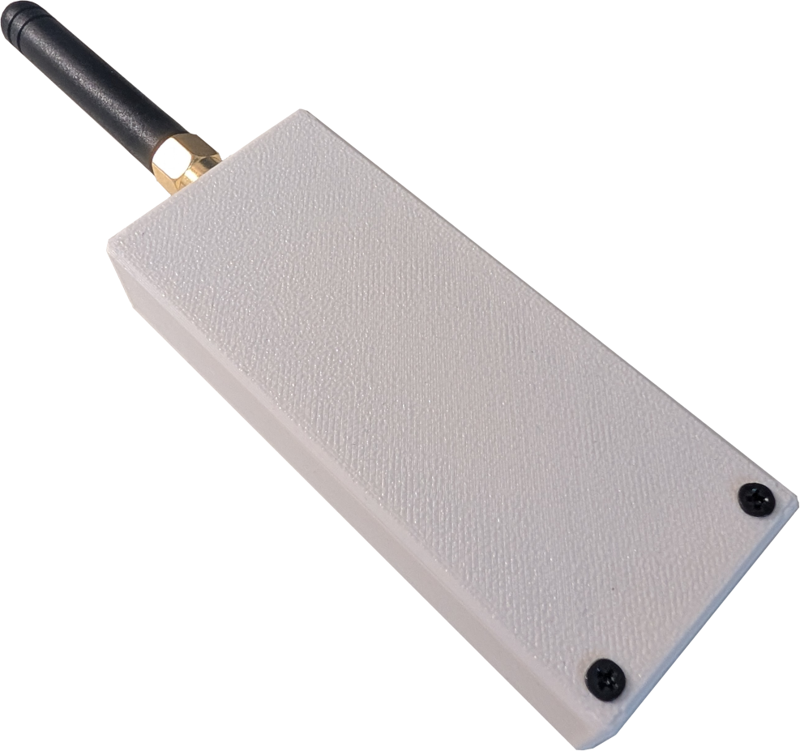
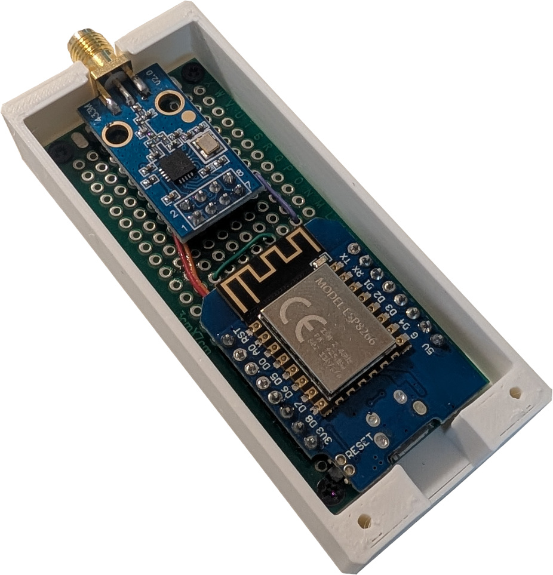

# Design A

This is a simple designed based around a prototyping board, a NodeMcu Mini D1 Module (with Esp8266, but Esp32 should also work) and a CC1101 wireless module.
| Fully assembled | PCB in case |
|:-:|:-:|
|  |  |

## BOM

| Component | Amount |
|:----------|-------:|
| 3x7 cm Prototyping circuit board (spacing 2.54 mm) | 1 |
| D1 Mini Nodemcu with ESP8266 | 1 |
| CC1101 Wireless module | 1 |
| 30 AWG Single Core | 
| M2x6 mm flathead screw | 3
| M2x10 mm flathead screw | 2
| 2.54 mm Male Header Pin (8 Pins) | 2

## Casing

The case can be 3D-printed on an FDM printer. I [designed in in OnShape](https://cad.onshape.com/documents/a087ceaa10398a32397951e5/w/04a95cbbb44f096dcf9181df/e/9778dcffe592d2e7d01ac76), but included the relevant STEP-files in this repository for convenience. The can be directly imported into slicers like OrcaSlicer.

## Notes

> Make sure to clip off the excess pins of the pin header on the back side of the PBC in order to make the controller board fit the case.